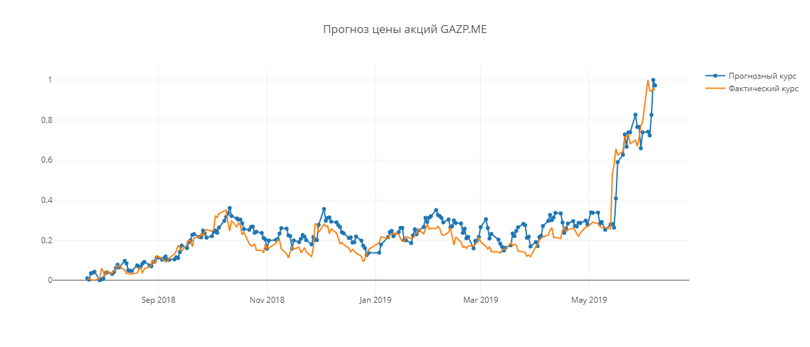

# NeuralStockPredictor
Прогнозирование цены акций с использованием сверточных и рекуррентных нейронных сетей на Keras (исследование)

**Исследование на Google Colab:**
- Русский язык 
- Плохой английский перевод 

**Краткое описание:**

Выявление закономерностей в курсах инструментов финансовых рынков позволяет построить модель для прогнозирования их будущего движения. Чтобы принимать успешные торговые решения, необходимо использовать различные методы и инструменты для анализа временных рядов.

Сперва были получены данные курса акций зарубежных компаний (**Tesla, Google, Amazon, Facebook**) и российских (**Газпром, Сбербанк, Роснефть, ВТБ**). Они содержат наблюдения по таким переменным, как цена открытия, закрытия, максимальная и минимальная, а также объемы торгов.

Сама по себе цена открытия является предыдущей ценой закрытия, однако по той причине, что фондовый рынок закрывается по окончанию торговой сессии, то при открытии, из-за недостаточного спроса на предложение (ну или наоборот), возникает разрыв между ценами, называемый **гэпом**. Он, в дальнейшем, и использовался нейросетью вместо цены открытия.

Данные максимальной и минимальной цены дня тоже были заменены на их разницу. По большей мере, основную информацию, которую они дают это то, на сколько сильно менялась цена в обоих направлениях в течение формирования свечи.

К имеющимся переменным были добавлены еще 4, такие как **волатильность**, которая помогает нейросети видеть периоды сильных колебаний цены; **коэффициент стохастического осциллятора**, демонстрирующий зоны перекупленности и перепроданности инструмента; **разница двух экспоненциальных скользящих средних**, показывающая локальные тренды; а также **коэффициент автокорреляции**, который помогает находить скрытые взаимосвязи между величинами одного временного ряда при заданном сдвиге.

В качестве архитектуры нейронной сети выступил гибрид сверточной и рекуррентной, который не только хорошо уменьшает размерность входных данных, сохраняя при этом их “природу”, но и фиксирует их временной порядок.

В начале входной массив данных поступает на слои свертки “Convolution” и объединения “**MaxPooling**”, которые уменьшают его размерность. После идет рекуррентный слой “**LSTM**”, позволяющий хранить в своей памяти данные на протяжении нескольких итераций. Далее слой сглаживания “**Flatten**” переводит двумерный массив данных в одномерный, после чего полносвязный слой “**Dense**” передает данные на слой “**Dropout**”, который путем исключения части данных, защищает сеть от переобучения. Далее, после линейной активации, на выходе получаем прогнозные значения.

После обучения нейросети ее точность составила около **60%**, что говорит о весьма хорошем качестве прогнозирования.

Помимо этого был проведен бэктестинг, представляющий из себя имитацию реальных торгов на исторических данных с учетом всех комиссий.

За 10 месяцев первоначальный капитал стабильно увеличился на 25%.

---

Мой научный руководитель [Kozlov Denis Yurievich](mailto:dyk.barnaul@gmail.com) также принимал участие в этом исследовании.

